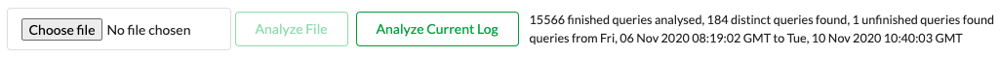
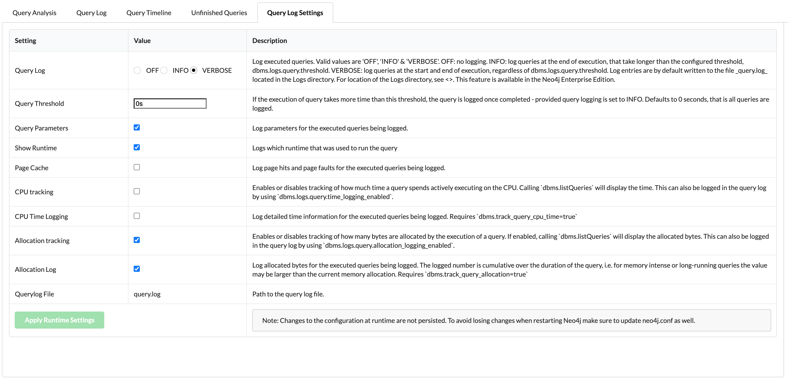
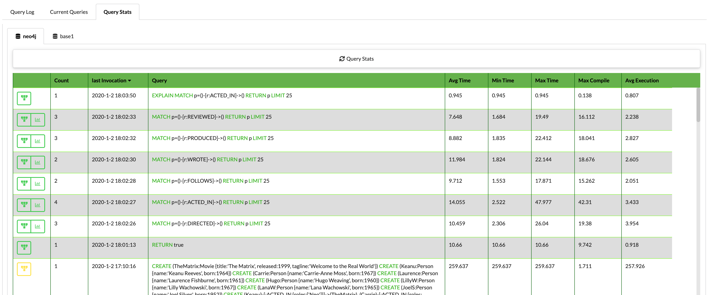

# Query Log Analyzer

The query log analyzer is a Neo4j Desktop App to help you to understand the query log file of a Neo4j Enterprise server. 
Since version 1.0.1 it is possible to see the current running queries on a database and see the query stats of the latest 8192 queries (version 3.5.4+).

```
How to run the query log analyzer
- via queryloganalyzer.graphapp.io in your browser:
  - for accessing a local non encrypted bolt connection 
    http://queryloganalyzer.graphapp.io
  - for accessing a database with an encrypted bolt connection
    https://queryloganalyzer.graphapp.io/
- via local files, just download a zip from the releases and then unzip and open the index.html page

TIP: you can also go to https://tools.neo4jlabs.com/ to find these links and other tools 
```   
When you experience slowness of the Neo4j server your queries may be inefficient or for example the query load on the server is too high. A good step is then to switch on the query log via the neo4j.conf file. Normally you will set a threshold to log only those queries which take more than an x amount of time (start with 100ms for example). This means that the queries shown in the query log tool are not the complete query load on the server! This tool however can give you a direction to find the possible causes for your query bottlenecks quickly. 
It is good practice to switch the query logging on for development and test servers and analyze your queries frequently when you develop your solution.  


Besides analyzing an uploaded query log file in the '__Query Log__' tool. it is possible to connect to a database which provides the following functionality. 
* Stream the query.log file directly from the server (depending on apoc) in the '__Query Log__' tool. When you are running in a cluster configuration all the query log files of the cluster members will be retrieved.
* get a list of current running queries in the '__Current Queries__' tool 
* retrieve the query statistics in the '__Query Stats__' tool. 


## Query Log

The 'Analyze File' function needs a query.log file to be uploaded, when apoc is installed then it is possible to analyze the current query.log file on the server via the 'Analyze Current Log' function. Both functions will analyze the query log file and after that the following message will be shown.



In this example the query log file has 15566 finished queries, 184 distinct queries are found. These 184 distinct queries are shown in the “Query Analysis” tab where you can find per query the statistics. 
Also there is 1 unfinished query found, this can be viewed in the Unfinished Queries tab.

With version 4+ of neo4j and the query log setting in VERBOSE mode queries are logged when they are started and when they are finished. The unfinished queries are those queries which are not completed at the time the query.log is read.

#### Query Analysis
In the Query Analysis Tab you will see the distinct queries ordered by Query Count * Avg Time descending. Which means that the most expensive query from the log file is placed on top. 

It is now possible to filter on summary entries. Just type in the text you want to search on and hit Enter to show the filtered results in the table below.


- The Query (the cell below AvgTime - Avg Mem values)

   This is the actual ‘distinct’ query string where Cypher key words are Highlighted.
- Query Count (sorting possible)

    The count of this distinct query in the log file. 

   <table>
   <tr>
   <td></td> 
   <td>A Filter to show only the query log records for this query in the Query Log Tab.</td>
    </tr>
   <tr>
    <td></td>
    <td>Highlight this query in the query log records in the Query Log Tab. It can be useful to see which queries are send to the server around the same time. </td>
    </tr>
   <tr>
     <td ></td>
    <td>Experimental; Show the occurrences of this query in the Query Timeline tab. </td>
    </tr>
   <tr >
     <td ></td> 
     <td>The query plan will be shown (explain). This is only available when there is a connection to a database and the query is not executed on the database 'system' (version 4+):
    
    
    </td>
    </tr>
   <tr >
    <td ></td>
    <td>When the query log file is from a version 4+ server then a label with the database name is shown where this query was executed on. When there is a connection to a cluster configuration then the db name can be appended with '@_instance number_'. 
        This instance number is just a number generated by this tool and refers to a host which is displayed in the left bar.</td>
    </tr>
   </table> 
    
- Avg Time (sorting possible) , Min Tim, Max Time

  The Time in milliseconds here is the total time the query uses to execute (query cpu + planning + waiting).
  
- Avg CPU (sorting possible)

  This is actual query execution time in milliseconds on the CPU. A 0 will be shown here when time logging is disabled. 
  
  ```requires: dbms.logs.query.time_logging_enabled=true and dbms.track_query_cpu_time=true```
- Max Planning (sorting possible)

  This is the maximum time spend in the query plannings phase. When you hover over the value you will see also the Min and Avg planning times. Normally the first time a query is fired the query is planned and the query execution plan is placed in the query cache. So the next time a query is executed the Planning time will be almost 0. When Time logging is disabled a 0 will be shown here.

  ```requires: dbms.logs.query.time_logging_enabled=true``` 
- Avg Waiting (sorting possible)

  The average waiting time before executing the query. The wait can be caused by heavy loads, so the query has to wait to get some execution time or the wait can be caused by waiting for database locks to be released. When Time logging is disabled a 0 will be shown here.

  ```requires: dbms.logs.query.time_logging_enabled=true ```
- Cache Hits % (sorting possible)

  This gives the percentage of the data for this query can be loaded from cache. 100% means that all the data is read from cache.

  ```requires: dbms.logs.query.page_logging_enabled=true ```
  
- Avg Mem (sorting possible)

  This is the average allocated bytes in memory of this query. Note that this is a cumulative value and tells something about how memory intensive the query was.

  ```requires: dbms.logs.query.allocation_logging_enabled=true and dbms.track_query_allocation=true```

- Protocol + Clients

  With Protocol you can see in which context the query is fired from. Values can be: 
  - bolt

    This is any bolt client connecting to the database.
  - http
  
    This is any http client using the neo4j rest interface (applicable to older neo4j versions)
  - embedded 
    
    This is a cypher call from database logic like procedures and functions.

  Also a client list is shown, this may be useful to identify the different ip numbers are sending requests to the neo4j server. Note that the bolt driver keeps a pool of connections open to the database, so you can have many clients from one ip number. 

#### Query Log
There are multiple ways to get in the Query Log tab. 
It will be opened upon clicking the Filter or Highlight icon in the Query Analysis tab or by opening the tab by clicking on it.
When opening the tab via a click on it there is the possibility to filter on log date (string) and on the query text. Just type in the text you want to search on and hit Enter to show the filtered results in the table below.


The query log tab shows every query log row. There is a lot of information in there so you need to scroll horizontally to see all the columns. 


From the First Query Analysis tab you can click on Highlight, then the selected query is highlighted. When you press “Filter” from the first tab only those query log records are shown in this tab. 
When you want to profile a query than you can copy the query and the used query parameters from this tab.

When there is a database connection then the '__Explain__' icon is shown in the Query Cell. A column neoDB is added to show on which version 4 db the query was executed. 
When there is a connection to a cluster and the log data is streamed from the cluster members the cluster number will be shown in the first column. Note this cluster instance number is generated by this tool and refers to a host in the left bar.

#### Query Timeline

The Query Timeline is an experimental feature and it plots the amount of queries per time unit (default is 5 minutes) and the average query time in seconds. This is bases on the log time which is not the same as the query start time. It will give you a quick overview when it was very busy on the server. 


#### Unfinished Queries

Since Neo4j version 4 it is possible to set the query logging in 'VERBOSE' mode. In that case the **start** and the **end** of the query will be logged.
In this view we show the queries which are **started** and where the end of the query is not logged yet in the query log. 
This can be useful to find queries which not ended before the server is stopped or restarted. Note to get the 'current' running queries in the database you can use the "Current Queries" function in this tool.
Also here you can use a filter to limit the results.


A note about the query Id. The query id in the log file is an id with the scope of the log file. In the header the max query-id is shown to see if the started queries are at the end of the log file. 

#### Query Log Settings

When there is a database connection it is possible to view the databases query log settings. When the database user has the proper admin rights then it is possible to change the dynamic configuration parameters.
Note: Changes to the configuration at runtime are not persisted. To avoid losing changes when restarting Neo4j make sure to update neo4j.conf as well.



When running in a cluster configuration, you can change the dynamic settings of each member in the cluster. Again to avoid losing changes when restarting Neo4j make sure to update neo4j.conf as well. 


The number in value@_number_ is generated by this tool, and is pointing to the host in the left bar.


## Current Queries


When you press the '__Queries__' bar then the current running queries are shown. When you have a version 4+ database then you can check for the current running queries per database by using the DB Name tab's.

Note that some cells can have no value which means that those timings are not collected. Look at the Query Analysis explanation above how to switch on 'timings' in the neo4j.conf file or via the procedure dbms.setConfigValue().

When connected to a cluster you will see the instance number in the tab's _prefix_@_number where the prefix is the database name in version 4 databases, it is empty in a version 3 database cluster.


 
 
The number in _prefix_@_number_ is generated by this tool, and is pointing to the host in the left bar.


## Query Stats



Since version 3.5.4 the database collects the query statistics for the last 8192 invocations 
and keeps that in memory. This is a great way to see what the latest load was on the server. 
If you want to fine tune your queries you have here the query times in micro seconds (the query log uses milliseconds)

##### Columns

The columns Count, Last Invocation, Avg Time, Max Compale and Avg Execution are sortable.

* The First column


  <table>
  <tr><td>  </td><td> When the query is less than 10000 characters then a green Explain icon is shown, and when you click on it you can do an explain on this query. </td></tr>
  <tr><td>  </td><td> When there are more than one invocations of a query, then the timeline function is available </td></tr>
  </table>
   

* Avg Time, Min Time, Max Time

  The total time of compiling and executing the query in milliseconds (with a precision to microseconds).
  
* Max Compile

  This the maximum compile time in milliseconds (with a precision to microseconds) from all the invocations of this specific query.
  This is the time the planner has taken to create a execution plan for the query.
  
* Avg Execution

  The average execution time of this query in milliseconds (with a precision to microseconds).


When connected to a cluster you will see the instance number in the tab's _prefix_@_number where the prefix is the database name in version 4 databases, it is empty in a version 3 database cluster.


 
The number in _prefix_@_number_ is generated by this tool, and is pointing to the host in the left bar.
